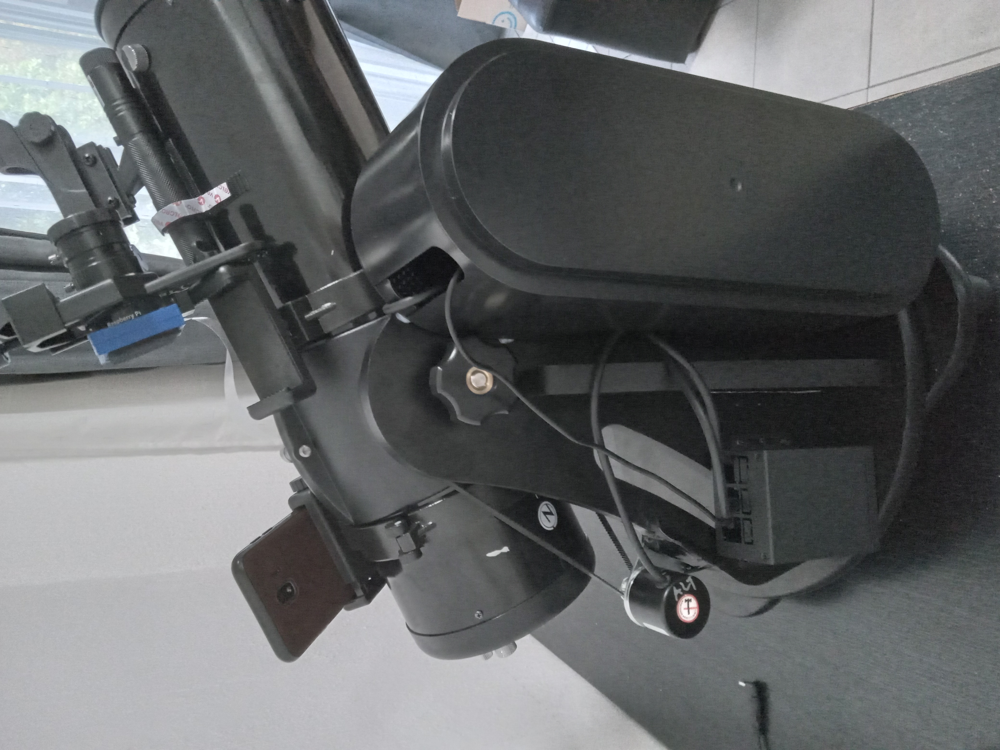
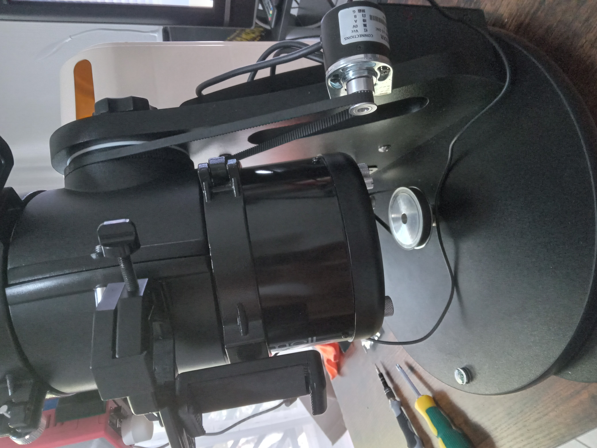
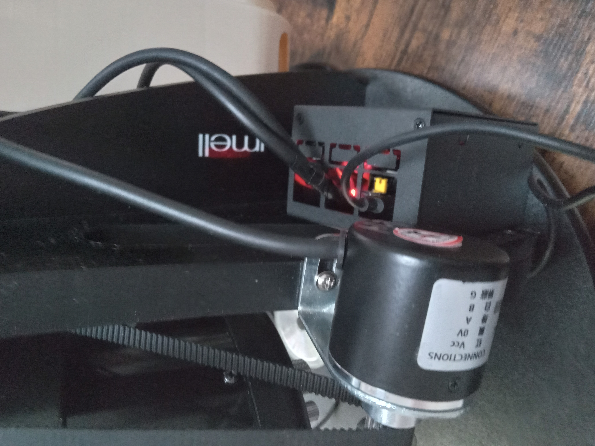
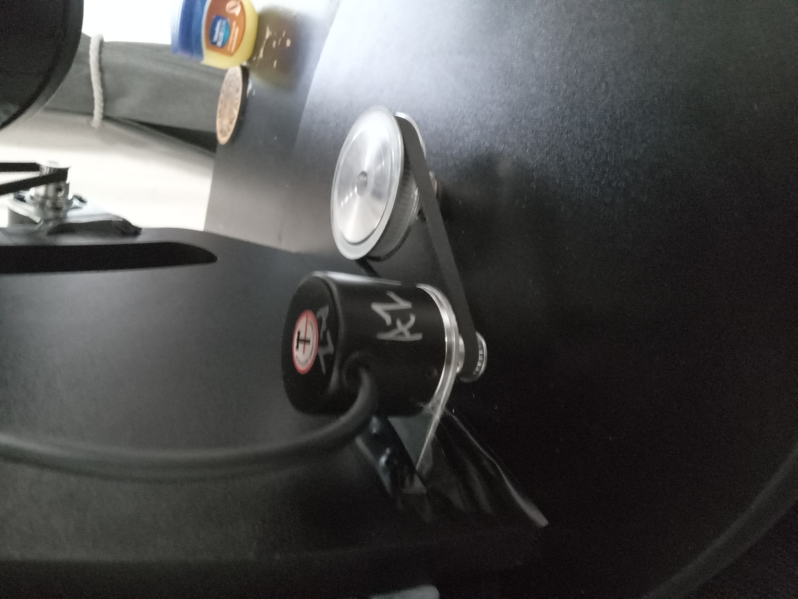
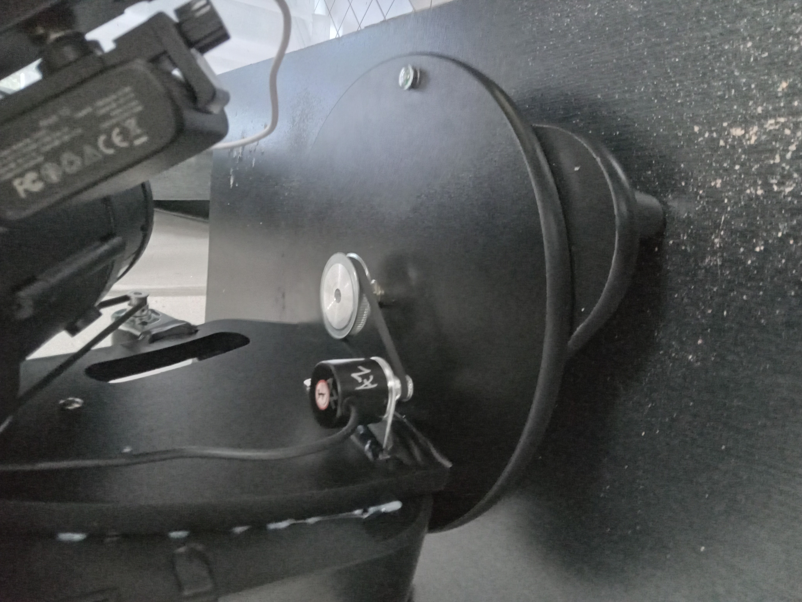
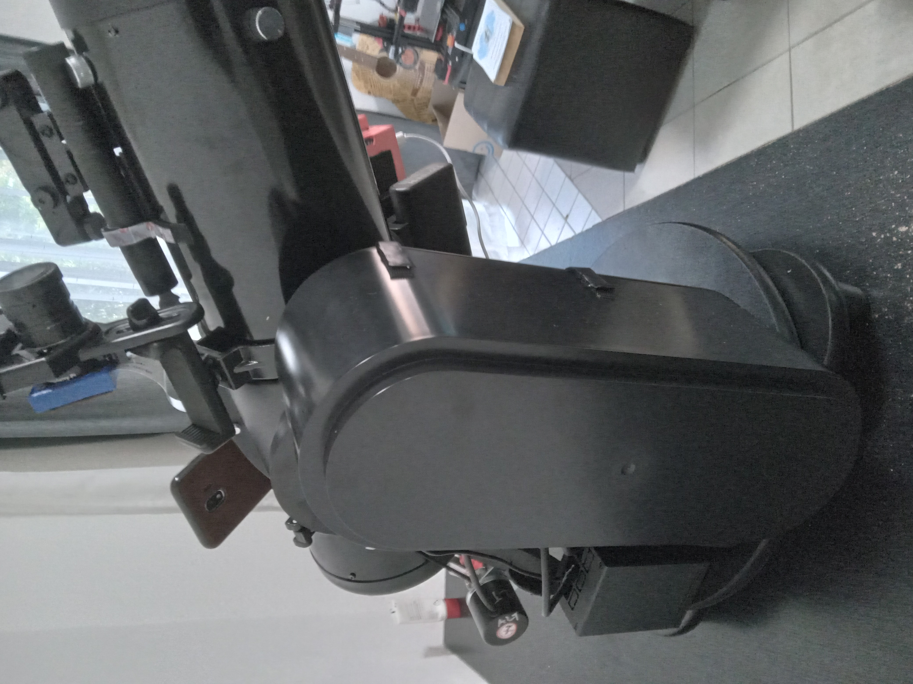
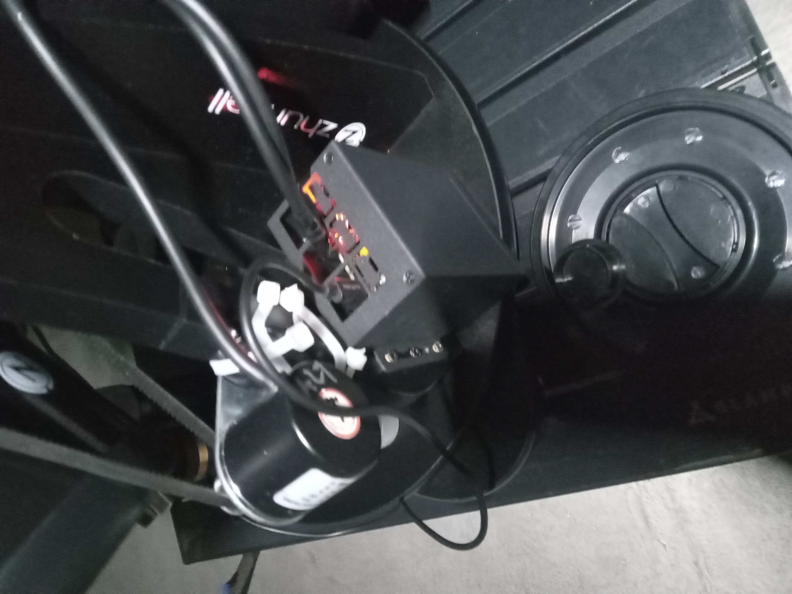

# Ezulwini Dobsonian DSC

This is my (Kgotso Koete) implementation of the original Dobsonian DSC project created by Vladimir Atehortúa. The original project can be found at [vlaate/DobsonianDSC](https://github.com/vlaate/DobsonianDSC).

## Project Overview

Amateur astronomers want to know where their telescope is pointing at. For this reason, many commercial telescopes (like the Orion IntelliScope) come equipped with "push to" features, often based on high precision optical rotary encoders attached to the telescope mount, and a hand control device with a database of coordinates of thousands of stars and other sky objects.

The mobile app [SkySafari](https://skysafariastronomy.com/) comes with a celestial database that is often more up-to-date, and it's user interface (a visual representation of the night sky) can be considered superior to what text lines on a push-to hand controller allow.

This project is an open source implementation of Digital Setting Circles for dobsonian telescopes. By using two inexpensive optical encoders and an ESP32 microcontroller it enables amateur astronomers to connect their dobsonian telescope to the SkySafari app.

## Implementation Details

This is what my implementation looks like:

You can watch my build video on YouTube (coming soon) or download it from:
- [Video download link](https://youtube.com/shorts/t46OHvNqT0E)

## Experiment Outcomes

While I thoroughly enjoyed building the DSC, I found that the 2 star alignment proved to be a hassle when finding deep sky objects that required more accuracy. This led me to implement a Raspberry Pi Platesolving E-Finder called the Cedar E-Finder by Steven Rosenthal.

The Cedar E-Finder:
- Can be connected to SkySafari
- Has a standalone web page that displays RA/Dec coordinates
- Features a standalone catalogue (coming soon)

## Acknowledgements

I would like to extend my sincere thanks to Vladimir Atehortúa for creating the original DSC project. His work provided me with a solid foundation to build upon and learn from.

## Documentation

  * This [Arduino IDE guide](https://github.com/vlaate/DobsonianDSC/blob/master/docs/ArduinoIDE.md) will provide beginner-friendly step by step instructions on how to install and configure the Arduino IDE on your computer, including the board managers and libraries required by the DSC, so that you can upload this software to an ESP-32 microcontroller.
  * This [Upload and Configuration guide](https://github.com/vlaate/DobsonianDSC/blob/master/docs/UploadConfigure.md) provides step by step instructions on how to upload the DSC software to the ESP32 microcontroller, how to configure the DSC using it's web configuration interface, and how to connect the SkySafari app to it.
  * The [Circuit Building Guide](https://github.com/vlaate/DobsonianDSC/blob/master/docs/Solderless.md) contains the circuit schematics, the parts list and a step-by-step instructions on how to assemble a beginner-friendly **solderless** implementation of the circuit.
  * You can ask questions or provide feedback in the [CloudyNights forums](https://www.cloudynights.com/topic/589521-37-dobsonian-dsc-for-diy-makers/).
  * Useful information on how to attach altitude encoders to dobsonians can be found [here](https://www.cloudynights.com/topic/772803-how-to-attach-altitude-encoders-to-dobsonians/)

## Pictures

| Column 1 | Column 2 |
|----------|----------|
|  |  |
|  |  |
|  |  |
|  | |

# Dependencies/Libraries/Packages

Board Manager Dependencies

1. esp32 by Espressif Systems v2.0.17

Libraries

1. ESP32Encoder by Kevin Harrington v0.11.7
2. ArduinoJson by Benoit Blanchon v6.19.4