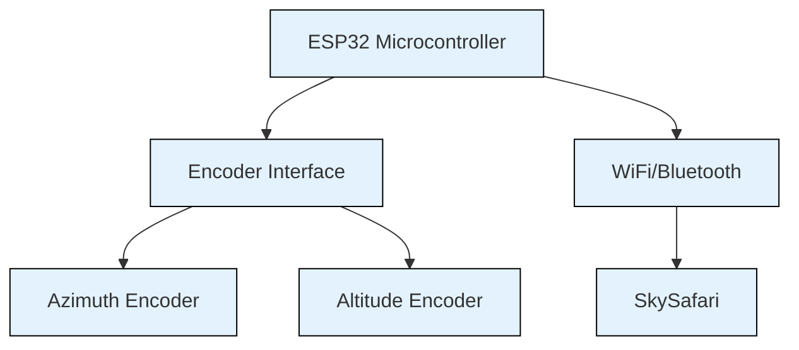
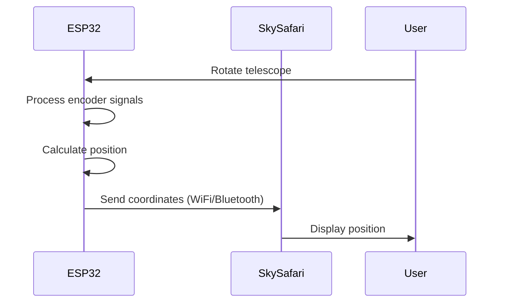

# Dobsonian Digital Setting Circles (DSC) System Explainer - Explainer is generated by AI (Cursor), please read with caution

This document explains how the Dobsonian Digital Setting Circles system works, from the hardware components to the communication with SkySafari.

## System Overview

## Hardware Components

The system consists of three main hardware components:

1. **ESP32 Microcontroller**
   - Main brain of the system
   - Handles all processing and communication
   - Runs on 3.3V power supply

2. **Optical Encoders**
   - Two incremental optical encoders with NPN open collector outputs
   - Connected to ESP32 pins:
     - Azimuth Encoder: GPIO18 (A), GPIO19 (B)
     - Altitude Encoder: GPIO25 (A), GPIO26 (B)
   - Provides quadrature signals for precise position tracking

3. **Power Supply**
   - 5V USB power bank or similar power source
   - Connected to ESP32 VIN and GND pins

## Encoder Operation

### How Encoders Work

1. **Quadrature Encoding**
   - Each encoder has two output channels (A and B)
   - Channels are 90° out of phase
   - Allows direction detection and precise position tracking

2. **Signal Processing**
   - ESP32 uses hardware pulse counters
   - Can track up to 20KHz pulse rate without missing steps
   - No interrupts or polling needed

## Communication Flow

## Data Format and SkySafari Integration

1. **Coordinate System**
   - Altitude: 0° to 90°
   - Azimuth: 0° to 360°
   - System uses steps per revolution (configurable)

2. **Output Format**
   - Sends coordinates in standard format that SkySafari understands
   - Uses either WiFi or Bluetooth for communication
   - Supports up to 3 simultaneous client connections

3. **SkySafari Integration**
   - SkySafari receives the encoder position data
   - Converts raw encoder steps to celestial coordinates
   - Displays the current pointing position of the telescope

## Configuration Options

The system can be configured through a web interface:

- WiFi Settings:
  - SSID
  - Password

- Bluetooth Settings:
  - Device name

- Encoder Settings:
  - Azimuth steps per revolution
  - Altitude steps per revolution

## Setup Process

1. Connect the encoders to the ESP32 pins
2. Power the system
3. Configure WiFi/Bluetooth settings
4. Calibrate the encoders
5. Connect to SkySafari

## Troubleshooting Tips

1. Ensure encoders are properly connected
2. Check power supply voltage
3. Verify WiFi/Bluetooth connections
4. Calibrate if position readings are inaccurate

## Technical Details

- Uses ESP32Encoder library for hardware counter
- Implements HTTP server for web configuration
- Supports both WiFi and Bluetooth communication
- Uses ArduinoJson for configuration management
- Implements MDNS for easy device discovery
